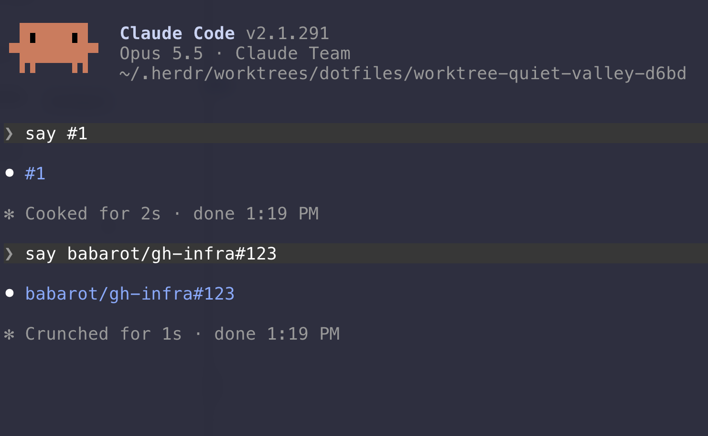

# claude-linkify

A Claude Code mod that makes links in Claude's replies clickable: bare URLs, and GitHub issue and pull request references like `#123`, `PR#123`, `repo#123` and `owner/repo#123`.



## Install

```sh
claude plugin marketplace add babarot/claude-linkify
claude plugin install linkify@claude-linkify
```

Then start a new session, or run `/reload-plugins` in one.

It needs a Claude Code version with mods (TypeScript plugin hooks). Tested with Claude Code 2.1.291 on macOS.

## What it links

In a session in `acme/web`:

| Written in a reply | Drawn as a link to |
| --- | --- |
| `#4` | `https://github.com/acme/web/issues/4` |
| `PR#1`, `pull#1` | `https://github.com/acme/web/pull/1` |
| `issue#2`, `issues#2` | `https://github.com/acme/web/issues/2` |
| `api#3` | `https://github.com/acme/api/issues/3`, a repository of the same owner |
| `babarot/hoge#1` | `https://github.com/babarot/hoge/issues/1`, from any directory |
| `https://example.com/path` | itself |

- The session repository is read from the `origin` remote of the session's working directory, again whenever the directory changes. Outside a git repository, or when `origin` is not on github.com, only `owner/repo#123` and URLs are linked.
- `PR`, `pull`, `issue` and `issues` before `#123` (any case) say what `#123` is in the session repository. Any other name is taken as a repository of the session repository's owner, except words no repository is named after, such as `step`, `no`, `line` or `version`, which stay text.
- A link to `/issues/123` also works for a pull request: GitHub redirects to it.
- A URL stops before punctuation that ends the sentence (`.`, `,`, an unbalanced `)`) and before non-ASCII text that follows it directly.

These are left alone:

- Fenced code blocks and inline code
- Existing markdown links and autolinks (`<https://...>`)
- References with a word character right after them (`#12abc`, `#1-2`), and a `#` right after `&` (`a&#123;`)
- A `#` inside a URL (`https://example.com/a#12`)

Only the drawing changes. The stored message and what the model reads stay as written.

## Settings

| Option | Default | What it does |
| --- | --- | --- |
| `repoRefs` | `true` | Link `repo#123` to a repository of the session repository's owner. Turn it off in `/config` if names before `#` in your replies link to repositories that don't exist. `PR#`, `issue#` and `#123` are linked either way |

## How it works

The mod hooks `ui.render` for `AssistantMessage`, rewrites the block's markdown with the links added, and hands it on to Claude Code's own renderer. It runs no commands and makes no network requests: the repository comes from `$.session.repo()`.

The rewriting is a plain function in [hooks/linkify.ts](./hooks/linkify.ts), with no dependency on Claude Code.

## Develop

```sh
git clone https://github.com/babarot/claude-linkify
cd claude-linkify
claude --plugin-dir "$PWD"
claude plugin validate .
claude plugin test .
```

The editor types live in `.claude-plugin/types/`. Claude Code generates them when it loads the mod, and they are not committed.

Releases are made with [tagpr](https://github.com/Songmu/tagpr). Merging its release PR bumps `version` in `.claude-plugin/plugin.json`, which is what makes `claude plugin update` pick up the new version, then tags `vX.Y.Z` and publishes a GitHub Release. Label a PR `kind/feature` or `kind/deprecation` for a minor release, `kind/breaking-change` for a major one.

## License

MIT
